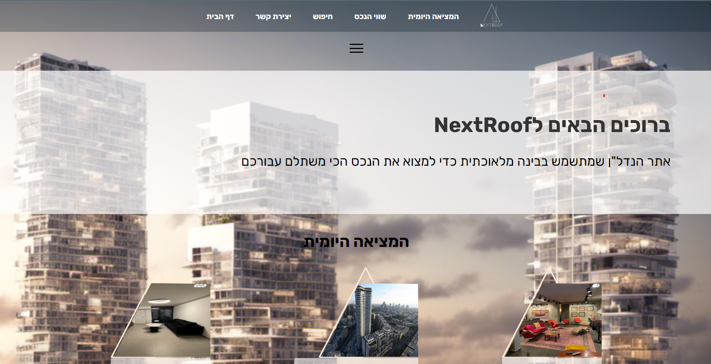
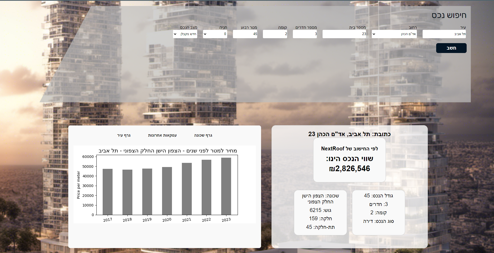

# NextRoof :house_with_garden:

NextRoof is a sophisticated web system leveraging artificial intelligence to predict real estate asset values in Israel.

## Objective :dart:

The core mission of NextRoof is to deliver trustworthy and pinpoint valuations for real estate assets. This empowers users, offering them clarity and confidence when entering the real estate market in Israel, whether buying or selling.

## Features :gear:

- **AI-Driven Estimations:** Leveraging advanced algorithms to provide accurate asset valuations.
- **User-Friendly Interface:** Ensuring users of all tech-savviness levels can navigate and understand their property's estimated value.
- **Up-to-date Data:** Constantly refreshed data ensuring users get the most recent and relevant information.

## How to Use :book:

1. Visit [NextRoof]([www.nextroof.co.il](https://www.nextroof.co.il/))  https://www.nextroof.co.il/
2. Enter the details of the property you wish to evaluate.
3. Get your estimated valuation instantly!

## Feedback :mailbox:

We're always looking to improve! If you have any suggestions, issues, or just want to let us know how we're doing, please [submit an issue](https://github.com/YOUR_USERNAME/NEXTROOF_REPO_NAME/issues) or contact us directly.

## License :scroll:

This project is licensed under the MIT License. See the [LICENSE](LICENSE) file for details.
