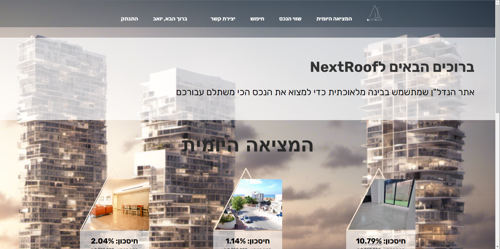
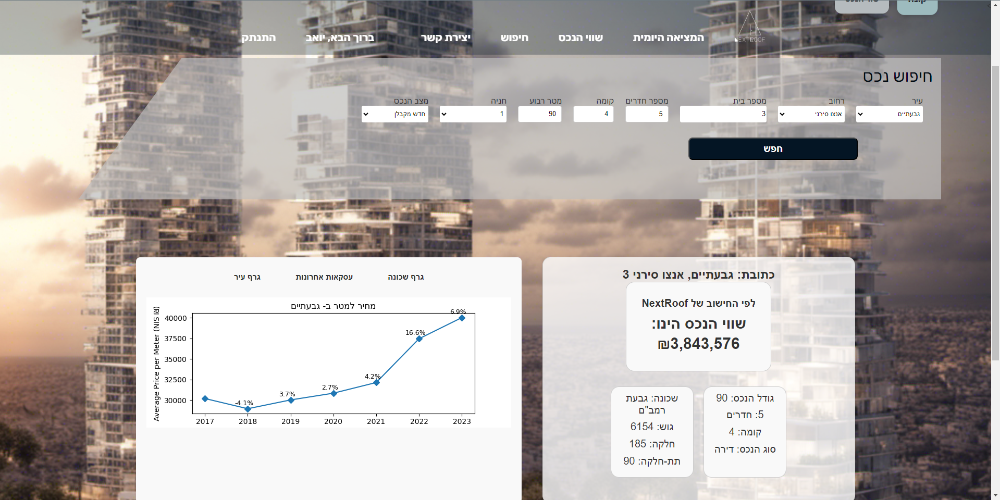

# NextRoof :house_with_garden:

NextRoof is a cutting-edge web platform that utilizes artificial intelligence to provide real-time estimations of real estate asset values in Israel. Designed with a dynamic recommendation engine, NextRoof employs intricate machine learning algorithms that continually update to mirror market dynamics. Beyond its predictive prowess, our system proactively identifies and showcases lucrative market deals from various online sources.
This repository encompasses the website's frontend and backend, developed using the Django Framework.

## link for the algorithm:
1. Visit [NextRoof]([https://github.com/yoavlv/NextRoof](https://github.com/yoavlv/NextRoof))  https://github.com/yoavlv/NextRoof

## Objective :dart:

The core mission of NextRoof is to deliver trustworthy and pinpoint valuations for real estate assets. This empowers users, offering them clarity and confidence when entering the real estate market in Israel, whether buying or selling.

## Features :gear:

- **AI-Driven Estimations:**  Advanced algorithms deliver spot-on real estate asset evaluations.
- **User-Friendly Interface:** Ensuring users of all tech-savviness levels can navigate and understand their property's estimated value.
- **Up-to-date Data:** Constantly refreshed data ensuring users get the most recent and relevant information.

## How to Use :book:

1. Visit [NextRoof]([www.nextroof.co.il](https://www.nextroof.co.il/))  https://www.nextroof.co.il/
2. Enter the details of the property you wish to evaluate.
3. Get your estimated valuation instantly!

## Tech:
Primary Development Language: Python (using the Django framework)
Backend: Django ,Postgeqsl
Frontend: JavaScript, HTML, CSS

## License :scroll:

This project is licensed under the MIT License. See the [LICENSE](LICENSE) file for details.
